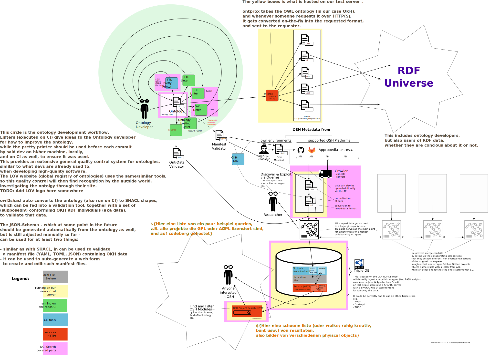

# Open Know-How (OKH)

<!--
SPDX-FileCopyrightText: 2021 - 2024 Robin Vobruba <hoijui.quaero@gmail.com>
SPDX-FileCopyrightText: 2021 Martin Häuer <martin.haeuer@ose-germany.de>

SPDX-License-Identifier: CC0-1.0
-->

**_Open Source Hardware technical documentation
in an open graph database._**

- <https://losh.opennext.eu> -
  browse the collected data
- <https://manifest.opennext.eu> -
  web-UI to create meta-data for a project

The most important files in this repo,
in descending order:

1. [src/spec/okh.ttl](src/spec/okh.ttl) -
    The main source file of this Specification
2. [src/spec/otrl.ttl](src/spec/otrl.ttl) -
    The source file of the Open Technology&Documentation Readiness Levels Specification
    (used by _okh.ttl_)
3. [src/schema/okh.schema.json](src/schema/okh.schema.json) -
    The [JSON-Schema] for the ([TOML]) manifests,
    which are commonly used as the source files by the projects or project platforms
    to store/transmit the projects data,
    even though the _real_ data is always the RDF form
    (which can be generated from these manifests).

The work here is based on the [Open Know-How Specification v1.0.0](
https://standards.internetofproduction.org/pub/okh/release/1),
as released in 2019.
The goal of the adaptations in this repo,
is to change the OKHv1 specification to make it applicable to
[Linked](https://en.wikipedia.org/wiki/Linked_data)
[Open](https://en.wikipedia.org/wiki/Open_data) data,
and rework data fields after latest research results.

## Intro

### History

In May 2024,
OKH LOSH was re-incorporated by its spiritual mother -
the [Internet of Production Alliance][IoPA] (formerly _MakerNet Alliance_) -
once again,
as the now official successor to OKH v1. \
This was a great social and political achievement,
with lots of arguing by [Open Source Ecology Germany e.V. (OSEG)][OSEG],
ice- and ground-breaking by Sarah Hutton from [IoPA],
and a final flood of good will and courage by Nathan from [IoPA].

LOSH adoption proposal

In August 2022,
this fork [was proposed](
https://community.internetofproduction.org/t/proposal-loshv1-as-the-base-for-merging-the-different-standards/129/7)
to the maintainers of the Open Know-How Specification
as the new official version of the specification.

Since February 2022,
OKH LOSH was continued within the [INTERFACER] project.

After March 2022,
[OSEG] maintained OKH LOSH -
which was the most advanced and most active OKH version between 2020 and 2024.
Part of that work was done within the [DAPSI] project,
while most of it was community work.

From early 2020,
the LOSH variety of the OKH standard -
which was the most advanced and most active OKH version until 2024 -
was developed as an [OPEN!NEXT] project,
which was a collaboration between 19 industry and academic partners
across Europe.

more about OPEN!NEXT

Funded by the [European Union](https://europa.eu/)'s [Horizon 2020] program,
this project seeks to enable small and medium enterprises (SMEs)
to work with consumers, makers, and other communities in rethinking
how products are designed and produced.
[Open Source Hardware](https://www.oshwa.org/definition/)
is a key enabler of this goal
where the design of a physical product is released with the freedoms
for anyone to study, modify, share, and redistribute copies.
These essential freedoms are based on those of [Open Source Software](
https://opensource.org/osd),
which is itself derived from [free software](
https://www.gnu.org/philosophy/free-sw.en.html)
where the word free refers to freedom, _not_ free-of-charge.
When put in practice,
these freedoms could potentially not only reduce proprietary vendor lock-in,
planned obsolescence, or waste but also stimulate novel –
even disruptive – business models.
The SME partners in [OPEN!NEXT] are experimenting
with producing open source hardware and even opening up the development process
to wider community participation.
They produce diverse products ranging from [desks](https://www.stykka.com/),
[cargo bike modules](http://www.xyzcargo.com/),
to a [digital scientific instrument platform](https://pslab.io/)
(and [more](https://opennext.eu/project-team/#sme)).

The work carried out in this repository was subject to WP3 of [OPEN!NEXT]
("Supporting production engineering with ICT infrastructure")
and lead by the [department of Information and Process Control
at the Fraunhofer Institute for Production Systems and Design Technology](
https://www.ipk.fraunhofer.de/en/about-us/organization/virtual-product-creation.html).

In mid 2019,
the first draft of OKH has been crafted,
and [OKH v1 was released][OKHv1] in the end of the same year
by a consortium of 10 organizations:

- [Appropedia]
- [Careables](https://www.careables.org/)
- [Docubricks](http://docubricks.com/)
- [e-NABLE](https://enablingthefuture.org/)
- [Humanitarian Makers](https://www.humanitarianmakers.org/)
- _MakerNet Alliance_ (now [IoPA])
- [Open Source Ecology Germany e.V.][OSEG]
- [Open Source Hardware Association][OSHWA]
- [Wevolver](https://www.wevolver.com/)
- [WikiFactory](https://wikifactory.com/)

lead by the _MakerNet Alliance_,
under a grant from the [The Shuttleworth Foundation](
https://www.shuttleworthfoundation.org/).

### tl;dr

a distributed database for OSH modules:
a demonstrator for a piece of ICT infrastructure to support design reuse

Standards are the backbone for this approach.

### short & crisp

We are aiming to build the (real) Internet of Things –
the Internet of Open Hardware.

## Scope

### Q&A

**What is the domain that the ontology will cover?**

Open source hardware modules. \
A "module" is defined here as an assembly with a defined purpose.
The scope/size of a module is defined by every project individually.
On git-based systems, every repository represents exactly one module
(except otherwise noted).

**Who's the end-user you have in mind?**

1. developers\
    the whole thing here is first and foremost about **design reuse**
2. manufacturers / service providers \
    find OSH published under a free/open license
    (we perform quality checks) so that you can modify,
    replicate and exploit OSH products
    however you like e.g. for cases of decentralized (mass) production,
    maintenance and service provision – or just for yourself.

**What's the problem this thing is solving?
Or rather, how does this 'tool' look like?**

1. It's a powerful filter for OSH.
    Find what you actually need.
2. It's a knowledge base capable of
    1. answering complex questions like
        "What development platforms are mainly used among OSH projects
        that got certified by [OSHWA] or attested according to DIN SPEC 3105-2?";
    2. cross-linking information
        (e.g. ongoing research with OSH designs
        related to sustainable agriculture).

**What are use-cases of the ontology?**

- find the OSH that solves your problem
  (→ **linking OSH modules with functional categories**)
  - filter for license, certificate, functional categories,
    file formats…
  - e.g. search for renewable energy related projects
- provide portable metadata: OSH can be published on various platforms
- facilitate packaging: essential files can be directly linked in the metadata, so:
  - we can run periodic tests to see whether files are still online,
  - you can download those files directly from an OKH web front-end
- RDF enables custom use cases
  (e.g. for researchers or other OSH platforms)
  e.g. by writing custom queries ([SPARQL])
  or by linking to other data/knowledge bases,
  such as a public DB about plants

**Who will use and maintain the ontology?**

1. all the awesome communities that provide the ontology modules we are using,
    e.g. SPDX
2. first and foremost: **us**
3. this ontology is yet to be presented to the Open Know-How Community;
    they may choose to endorse this approach as Version 2.0.0 of their specification.

### Outlook

**We want to organise open source hardware in a graph database.**

There's a long list of [cool use cases](doc/requirements/LinkedData_Qs.md)
of such a knowledge base.
Lots of information (including the technical documentation itself)
could be stored as linked open data or simply linked together.

The future could bring e.g.:

- automated quality & completeness checks for the technical documentation
- unambiguous reference of all parts
  (e.g. to a library of standard components or to other OSH)
- automated matchmaking to manufacturers based on production metadata
- automated matchmaking with suitable finding opportunities

## Technical details

**How does the data-flow generally work?**

## Ecosystem

TODO Overall narrative

At the core of the OKH ecosystem, we have [the standard](#standard).
It defines the structure of mandatory and optional fields
that can be used to describe a hardware design project,
and how those fields are supposed to be encoded (e.g. file-format).

Around it,
we have many software tools,
generally following the [UNIX philosophy].
They help in converting the standard into different formats,
tailored either to humans ([Markdown], HTML, PDF)
or one program ([SHACL] (tbd))
or the other ([JSON-Schema] (tbd)).
This allows different groups of people to interact with the standard
in a way that is natural and optimal to them,
and thus broadens the community and the mindset that influences the standard.
An other of these tools takes the data of individual hardware projects
encoded in one version of the standard,
and [converts it to a newer one](
https://github.com/OPEN-NEXT/LOSH-OKH-tool#conversion).

The goal is to have as little custom tools as possible,
and rather rely on standard formats and workflows.
For example:
We currently have [a tool to validate our RDF data](
https://github.com/OPEN-NEXT/LOSH-OKH-tool#validation).
Once our [SHACL] generation works well though,
we will be able to use "off the shelf" [SHACL] validators instead,
apart from the other use cases that [SHACL] will make available. \
Validation in different formats allows anyone
at any point in the process to analyze the data.
That includes hardware project owners
that assemble (some of) their data manually,
standard developers/contributors that want to test a change
against a collection of HW projects,
people that write tools that convert to the standards format,
HW project hosting providers that generate the data from their internal DB
and data aggregation sites of any kind.
To enhance data integrity as much as possible is essential
to come up with a usable data set to search in.
To do it at any point in the process fosters a [fail-fast] workflow,
which optimally results in HW project maintainers
to see issues early after every change -
when they still know what they changed -
which optimally equips them to solve the issue,
together with the validation tools error report.
We figured this to be the optimal way
to giveHW project owners the power
to ensure they can be found.
In more traditional systems,
if their data is invalid,
they would either be completely silently ignored
and not enter the DB of all things,
or at best they would get info on some centralized web interface about the issue,
if they happen to check it.
If the error happens to lay on the data aggregators side
or in the specification (standard),
they might not have a way to right it,
if they are lucky enough to even understand what is going wrong.

TODO More!

- Test (has to be run locally): [RDF-DB tester]
  This fetches the crawled data, starts a DB,
  enters the data into the DB,
  and then allows to query that data by code ([SPARQL] querries)
  or through a web interface (also [SPARQL] querries)
  with syntax highlighting and showing the results in a nice table format.
  Crawled data (from 2022):
  <https://gitlab.opensourceecology.de/verein/projekte/losh-rdf/-/tree/main/RDF>
- Crawler:
  <https://github.com/OPEN-NEXT/LOSH-krawler>
- Tool to Generate a Report including Data Statistics:
  <https://github.com/OPEN-NEXT/LOSH-Reporter>
- browsing/searching web-interface for the crawled data:
  <https://losh.opennext.eu>

### Standard

The standard/meta-data specification
is developed and published in this very repository. :)

open standards used:

- The [DIN SPEC 3105](https://gitlab.com/OSEGermany/OHS-3105)
  (published under CC-BY-SA-4.0 in June 2020)
- and the [OH-TsDC](https://gitlab.com/OSEGermany/oh-tsdc) define clear,
  enforceable criteria for technical documentation of OSH
  (+ a community-based assessment procedure in order to prove that)

Together,
these form a first approach to organize OSH through reasonable metadata.

Can I see the ontology structure somewhere?

Our CI automatically generates [exports from the TTL source](
https://iop-alliance.github.io/OpenKnowHow/).

You can find:

- Markdown files laying out the structure,
- GraphViz/DOT graps/diagrams representing the structure,
- PNG & SVG renders of the graphs/diagrams

Note that when invalid TTL files are pushed,
the CI will give back an error and no exports will be available.

### Crawler

The crawler that collects projects data from different platforms.

- code: <https://github.com/OPEN-NEXT/LOSH-krawler>

It is currently (July 2024) not run periodically.

### Frontend

For now,
the old, outdated front-end of the OKH LOSH system
is still the easiest way to get an idea
about what will be possible with this system for end-users.
It helps you to search the data on our Wikibase instance.

- code: <https://github.com/wmde/LOSH-Frontend/>
- test-instance: <https://losh.opennext.eu/>

If you are ready for a more hands-on approach of testing,
you may also try to use a more up-to-date approach
with our [RDF-DB tester].

## Want to contribute?

'til we have a proper contribution guide,
just join our group on [Telegram](
https://t.me/joinchat/FiYCVhD-NPfpMr5PnZaiNQ)
:)

In any case, collaboration in this project must follow our [Code of Conduct](
CODE_OF_CONDUCT.md)

## Why are we doing this?

"Human history, closely explored,
boils down to the history of invention of better tools." \
– Ernst Knapp: cultural geographer (1808-1896)

[Appropedia]: https://www.appropedia.org/
[DAPSI]: https://dapsi.ngi.eu/
[fail-fast]: https://en.wikipedia.org/wiki/Fail-fast_system
[Horizon 2020]: https://research-and-innovation.ec.europa.eu/funding/funding-opportunities/funding-programmes-and-open-calls/horizon-2020_en
[INTERFACER]: https://www.interfacerproject.eu/
[IoPA]: https://www.internetofproduction.org/
[JSON-Schema]: https://json-schema.org/
[Markdown]: https://en.wikipedia.org/wiki/Markdown
[OKHv1]: https://standards.internetofproduction.org/pub/okh/release/1
[OPEN!NEXT]: https://opennext.eu/
[OSEG]: https://www.ose-germany.de/
[OSHWA]: https://www.oshwa.org/
[RDF-DB tester]: https://github.com/OPEN-NEXT/LOSH-RDF-DB-tester/
[SHACL]: https://en.wikipedia.org/wiki/SHACL
[SPARQL]: https://en.wikipedia.org/wiki/SPARQL
[TOML]: https://toml.io/en/
[UNIX philosophy]: https://cscie2x.dce.harvard.edu/hw/ch01s06.html
